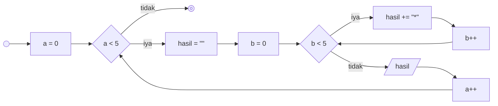
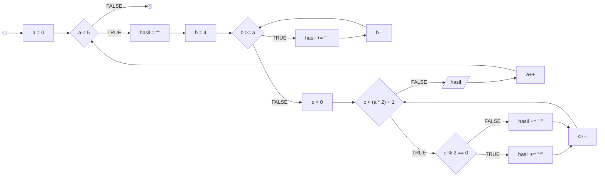
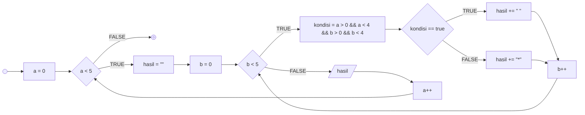

# Minitask 3

## Perulangan pola 1

```mermaid

flowchart LR

A@{shape: sm-circ, label: "start"}
B@{shape: fr-circ, label: "end"}
C@{shape: rect, label: "a = 0"}
D@{shape: rect, label: "b = 0"}
E@{shape: rect, label: "hasil = #quot;#quot;"}
F@{shape: diam, label: "a < 5"}
G@{shape: diam, label: "b < 5"}
H@{shape: rect, label: "a++"}
I@{shape: rect, label: "b++"}
J@{shape: rect, label: "hasil += #quot;*#quot;"}
K@{shape: lean-r, label: "hasil"}

A --> C --> F --iya--> E --> D --> G --iya--> J --> I --> G
G --tidak--> K --> H --> F

F --tidak--> B

```

## Perulangan pola 2

```mermaid

flowchart LR

A@{shape: sm-circ, label: "start"}
B@{shape: fr-circ, label: "end"}
C@{shape: rect, label: "a = 0"}
D@{shape: rect, label: "b = 0"}
E@{shape: rect, label: "hasil = #quot;#quot;"}
F@{shape: diam, label: "a < 5"}
G@{shape: diam, label: "b <= a"}
H@{shape: rect, label: "a++"}
I@{shape: rect, label: "b++"}
J@{shape: rect, label: "hasil += #quot;*#quot;"}
K@{shape: lean-r, label: "hasil"}

A --> C --> F --iya--> E --> D --> G --iya--> J --> I --> G
G --tidak--> K --> H --> F

F --tidak--> B

```

## Perulangan pola 3

```mermaid
  flowchart LR

  A@{shape: sm-circ, label: "start"}
  B@{shape: fr-circ, label: "end"}
  C@{shape: rect, label: "a = 0"}
  D@{shape: rect, label: "b = 4"}
  E@{shape: rect, label: "a++"}
  G@{shape: rect, label: "hasil = #quot;#quot;"}
  H@{shape: diam, label: "a < 5"}
  I@{shape: diam, label: "b >= a"}
  J@{shape: lean-r, label: "hasil"}
  K@{shape: rect, label: "hasil += #quot; #quot;"}
  L@{shape: rect, label: "b--"}
  M@{shape: rect, label: "c = 0"}
  N@{shape: diam, label: "c < (a * 2) + 1"}
  O@{shape: rect, label: "hasil += #quot;*#quot;"}
  P@{shape: rect, label: "c++"}
  Q@{shape: diam, label: "c % 2 == 0"}
  R@{shape: rect, label: "hasil += #quot; #quot;"}

  A --> C --> H --TRUE--> G --> D --> I --TRUE--> K --> L --> I

  I --FALSE--> M --> N --TRUE--> Q --TRUE--> O

  Q --FALSE--> R

  O & R --> P --> N

  N --FALSE--> J --> E --> H

  H --FALSE--> B

```

## Perulangan pola 4

```mermaid
  flowchart LR
  A@{shape: sm-circ, label:"start"}
  B@{shape: rect, label: "a = 0"}
  C@{shape: diam, label: "a < 5"}
  D@{shape: fr-circ, label: "end"}
  E@{shape: rect, label: "hasil = #quot;#quot;"}
  F@{shape: rect, label: "b = 0"}
  G@{shape: diam, label: "b < 5"}
  H@{shape: rect, label: "hasil += #quot; #quot;"}
  I@{shape: diam, label: "kondisi == true"}
  J@{shape: rect, label: "b++"}
  K@{shape: rect, label: "kondisi = a > 0 && a < 4 && b > 0 && b < 4"}
  L@{shape: rect, label: "hasil += #quot;*#quot;"}
  M@{shape: rect, label: "a++"}
  N@{shape: lean-r, label: "hasil"}


  A --> B --> C --TRUE--> E --> F --> G --TRUE--> K --> I --TRUE--> H

  I --FALSE--> L

  H & L --> J --> G

  G --FALSE--> N --> M --> C

  C --FALSE--> D

```
