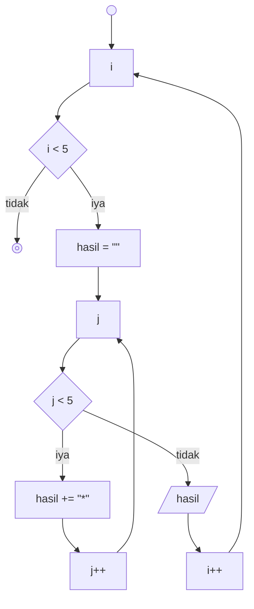

# Minitask 3

## Perulangan pola

```mermaid

flowchart TD

A@{shape: sm-circ, label: "start"}
B@{shape: fr-circ, label: "end"}
C@{shape: rect, label: "i"}
D@{shape: rect, label: "j"}
E@{shape: rect, label: "hasil = #quot;#quot;"}
F@{shape: diam, label: "i < 5"}
G@{shape: diam, label: "j < 5"}
H@{shape: rect, label: "i++"}
I@{shape: rect, label: "j++"}
J@{shape: rect, label: "hasil += #quot;*#quot;"}
K@{shape: lean-r, label: "hasil"}

A --> C --> F --iya--> E --> D --> G --iya--> J --> I --> D
G --tidak--> K --> H --> C

F --tidak--> B


```
